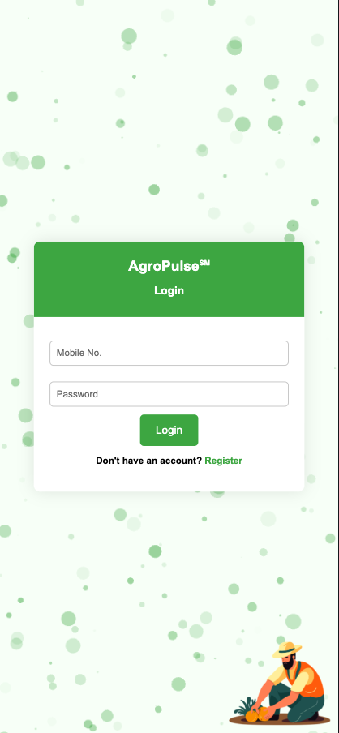

# Intelligent Farming Advisor 🌱🚜

This project utilizes real-time weather and soil data fetched from APIs and sensors like NPK sensor and ESP32. Through Firebase integration, it analyzes optimal conditions for various crops, offering tailored advice to farmers. Future plans include regional language SMS reports and precision irrigation.

🌐 Website: [Intelligent Farming Advisor](https://intelligent-farming-advisor.netlify.app/)

### How It Helps 🌾
- Provides real-time weather and soil insights.
- Offers personalized crop advice.
- Enhances farming efficiency and sustainability.
- Future plans include SMS reports and precision irrigation.

### Screenshots 📸

  
  
  
  
  
  
  
  
  
  
  
  
  
  

### Contributions 🔗
Feel free to contribute and make farming smarter! 🚀🌱

📝 **No License** - Open for contributions!